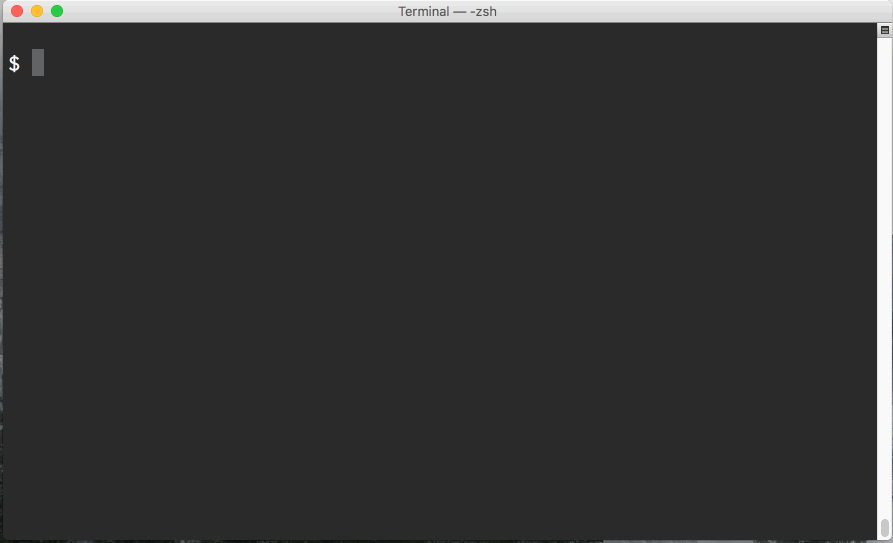

# sqldef [](https://travis-ci.org/k0kubun/sqldef)

The easiest idempotent MySQL/PostgreSQL schema management by SQL.

This is inspired by [Ridgepole](https://github.com/winebarrel/ridgepole) but using SQL,
so there's no need to remember Ruby DSL.



## Project Status

Proof of Concept.

Not ready for production, but it's already playable with both MySQL and PostgreSQL.

## Installation

Download the single-binary executable for your favorite database from:

https://github.com/k0kubun/sqldef/releases

## Usage

### mysqldef

`mysqldef` should work in the same way as `mysql` for setting connection information.

```
$ mysqldef --help
Usage:
  mysqldef [options] db_name

Application Options:
  -u, --user=user_name       MySQL user name (default: root)
  -p, --password=password    MySQL user password, overridden by $MYSQL_PWD
  -h, --host=host_name       Host to connect to the MySQL server (default: 127.0.0.1)
  -P, --port=port_num        Port used for the connection (default: 3306)
      --file=sql_file        Read schema SQL from the file, rather than stdin (default: -)
      --dry-run              Don't run DDLs but just show them
      --export               Just dump the current schema to stdout
      --help                 Show this help
```

#### Example

```sql
# Make sure that MySQL server can be connected by mysql(1)
$ mysql -uroot test -e "select 1;"
+---+
| 1 |
+---+
| 1 |
+---+

# Dump current schema by adding `def` suffix and --export
$ mysqldef -uroot test --export
CREATE TABLE `user` (
  `id` bigint(20) unsigned NOT NULL AUTO_INCREMENT,
  `name` varchar(191) DEFAULT 'k0kubun',
  PRIMARY KEY (`id`)
) ENGINE=InnoDB DEFAULT CHARSET=utf8mb4;

# Save it to edit
$ mysqldef -uroot test --export > schema.sql
```

Update the schema.sql like (instead of `ADD INDEX`, you can just add `KEY index_name (name)` in the `CREATE TABLE` as well):

```diff
 CREATE TABLE user (
   id BIGINT UNSIGNED NOT NULL AUTO_INCREMENT PRIMARY KEY,
   name VARCHAR(128) DEFAULT 'k0kubun',
+  created_at DATETIME NOT NULL
 ) Engine=InnoDB DEFAULT CHARSET=utf8mb4;
+
+ALTER TABLE user ADD INDEX index_name(name);
```

And then run:

```sql
# Check the auto-generated migration plan without execution
$ mysqldef -uroot test --dry-run < schema.sql
--- dry run ---
Run: 'ALTER TABLE user ADD COLUMN created_at datetime NOT NULL ;'
Run: 'ALTER TABLE user ADD INDEX index_name(name);'

# Run the above DDLs
$ mysqldef -uroot test < schema.sql
Run: 'ALTER TABLE user ADD COLUMN created_at datetime NOT NULL ;'
Run: 'ALTER TABLE user ADD INDEX index_name(name);'

# Operation is idempotent, safe for running it multiple times
$ mysqldef -uroot test < schema.sql
Nothing is modified
```

### psqldef

`psqldef` should work in the same way as `psql` for setting connection information.

```
$ psqldef --help
Usage:
  psqldef [option...] db_name

Application Options:
  -U, --user=username        PostgreSQL user name (default: postgres)
  -W, --password=password    PostgreSQL user password, overridden by $PGPASS
  -h, --host=hostname        Host to connect to the PostgreSQL server (default: 127.0.0.1)
  -p, --port=port            Port used for the connection (default: 5432)
  -f, --file=filename        Read schema SQL from the file, rather than stdin (default: -)
      --dry-run              Don't run DDLs but just show them
      --export               Just dump the current schema to stdout
      --help                 Show this help
```

#### Example

```sql
# Make sure that PostgreSQL server can be connected by psql(1)
$ psql -U postgres test -c "select 1;"
 ?column?
----------
        1
(1 row)

# Dump current schema by adding `def` suffix and --export
$ psqldef -U postgres test --export
CREATE TABLE public.users (
    id bigint NOT NULL,
    name text,
    age integer
);

CREATE TABLE public.bigdata (
    data bigint
);

# Save it to edit
$ psqldef -U postgres test --export > schema.sql
```

Update the schema.sql like:

```diff
 CREATE TABLE users (
     id bigint NOT NULL PRIMARY KEY,
-    name text,
     age int
 );

-CREATE TABLE bigdata (
-    data bigint
-);
```

And then run:

```sql
# Check the auto-generated migration plan without execution
$ psqldef -U postgres test --dry-run < schema.sql
--- dry run ---
Run: 'DROP TABLE bigdata;'
Run: 'ALTER TABLE users DROP COLUMN name;'

# Run the above DDLs
$ psqldef -U postgres test < schema.sql
Run: 'DROP TABLE bigdata;'
Run: 'ALTER TABLE users DROP COLUMN name;'

# Operation is idempotent, safe for running it multiple times
$ psqldef -U postgres test < schema.sql
Nothing is modified
```

## Supported features

Following DDLs can be generated by updating `CREATE TABLE`.
Some of them can also be used for input schema file.

- MySQL
  - Table: CREATE TABLE, DROP TABLE
  - Column: ADD COLUMN, CHANGE COLUMN, DROP COLUMN
  - Index: ADD INDEX, ADD UNIQUE INDEX, CREATE INDEX, CREATE UNIQUE INDEX, DROP INDEX
  - Primary key: ADD PRIMARY KEY, DROP PRIMARY KEY
  - Foreign Key: ADD FOREIGN KEY, DROP FOREIGN KEY
- PostgreSQL
  - Table: CREATE TABLE, DROP TABLE
  - Column: ADD COLUMN, DROP COLUMN
  - Index: CREATE INDEX, CREATE UNIQUE INDEX, DROP INDEX
  - Foreign Key: ADD FOREIGN KEY, DROP CONSTRAINT

## Limitations

Because sqldef distinguishes table/index/column by its name, sqldef does NOT support:

- RENAME TABLE
- RENAME INDEX
  - DROP + ADD could be fine for index, though
- CHANGE COLUMN for rename

To rename them, you would need to rename manually and use `--export` again.

## Development

Following settings could be dangerous. Please develop sqldef under a secure network.

### mysqldef

To run integration tests, `mysql -uroot` needs to succeed by following options:

* Run: `sudo mysqladmin -u root -p password ''`
* Login to mysql with administrator user somehow, and run `SET PASSWORD FOR root@localhost=PASSWORD('');`

Then running `make test-mysqldef` will help your development.

### psqldef

To run integration tests, `psql -Upostgres` needs to succeed by:

1. Open `pg_hba.conf` (ex: `/etc/postgresql/10/main/pg_hba.conf`)
2. Change `local all postgres peer` to `local all postgres trust`
3. Restart postgresql server (ex: `systemctl restart postgresql`)

## License

Unless otherwise noted, the sqldef source files are distributed under the MIT License found in the LICENSE file.

[sqlparser](./sqlparser) is distributed under the Apache Version 2.0 license found in the sqlparser/LICENSE.md file.
